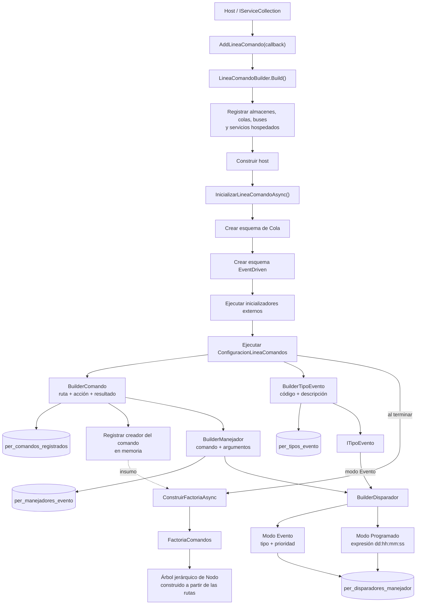
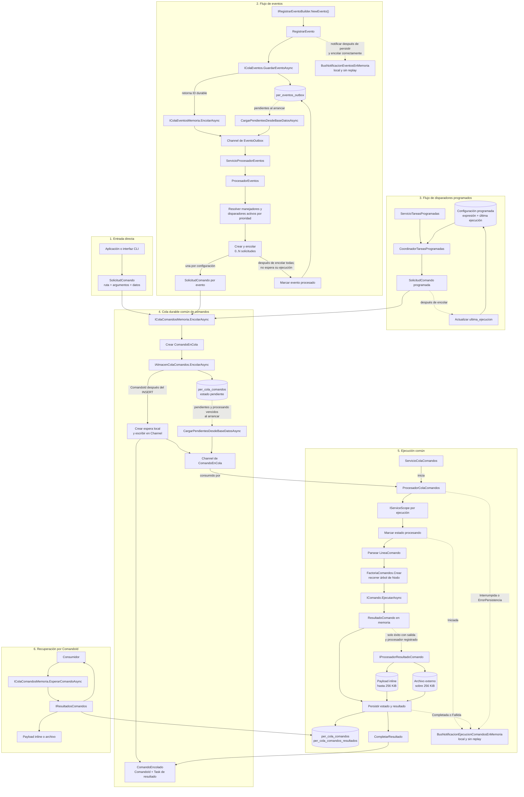

# LineaComando 

Motor comandos para aplicaciones .NET. Persiste cada solicitud en PostgreSQL o SQL Server antes de activarla mediante canales en memoria, ejecuta comandos desde servicios hospedados y conserva su estado y resultado para poder consultarlos después.

Además del encolado directo, el mismo flujo de comandos puede originarse desde eventos persistidos o tareas programadas. También permite observar en memoria los eventos registrados y los estados de ejecución de cada ruta de comando.

## Qué problema resuelve

Permite definir y ejecutar comandos desde una interfaz de línea de comandos o desde el código de una aplicación. A partir de sus rutas construye internamente un árbol jerárquico, permite agrupar múltiples comandos bajo ramas comunes y gestiona su ciclo completo: resolución, preparación, ejecución, resultado y notificaciones.

## Compatibilidad

| Elemento | Soporte en 4.2 |
|---|---|
| Framework | .NET 10 (`net10.0`) |
| PostgreSQL | Soportado mediante Npgsql |
| SQL Server | Soportado mediante Microsoft.Data.SqlClient |
| Esquema predeterminado PostgreSQL | `public` |
| Esquema predeterminado SQL Server | `dbo` |

## Arquitectura



La inicialización registra las definiciones funcionales y conserva en memoria los creadores de comandos. Con ellos construye el árbol jerárquico que la factoría recorre posteriormente para resolver cada ruta.



La entrada directa, el procesamiento de eventos y los disparadores programados son recorridos independientes. Los tres convergen únicamente cuando producen una `SolicitudComando` para la cola durable común. Desde ese punto, `ProcesadorColaComandos` es el único componente que resuelve el árbol, ejecuta la acción, persiste el resultado y publica las notificaciones de ejecución. Los `Channel` activan trabajo dentro del proceso, mientras la base de datos conserva las solicitudes, los eventos y los resultados durables.

### Componentes

| Componente | Responsabilidad |
|---|---|
| `Comandos` | Parser, árbol de rutas, parámetros, contratos y clases base de comandos |
| `LineaComando.Cola` | Persistencia, cola local, procesamiento, estados y resultados durables |
| `LineaComando.EventDriven` | Outbox, tipos de evento, manejadores, tareas y buses de notificaciones |
| `LineaComando.Builder` | Registro en DI, configuración e inicialización de infraestructura |

### Ciclo de un comando

1. `EncolarAsync` convierte la solicitud en un registro con estado `pendiente`.
2. El registro se inserta en la base de datos.
3. Solo después de persistirlo se escribe en el `Channel` local.
4. `ServicioColaComandos` consume el canal y limita el paralelismo configurado.
5. El procesador marca el registro como `procesando` y publica `Iniciada`.
6. La ruta se resuelve en la factoría y se crea el comando.
7. El comando se ejecuta.
8. El estado final y, cuando corresponde, el payload serializado se persisten.
9. Se publica `Completada`, `Fallida`, `Interrumpida` o `ErrorPersistencia`.
10. Tras persistir un resultado completado o fallido, se completa la espera local asociada a `ComandoEncolado.Resultado`.

Si el token del servicio hospedado cancela la ejecución o la persistencia, se publica `Interrumpida`, pero la espera local puede quedar pendiente. El consumidor debe aplicar su propio `CancellationToken` o timeout al esperar el resultado.

Al arrancar, el servicio vuelve a cargar desde la base de datos los comandos pendientes y aquellos que permanecen en `procesando` después del tiempo de recuperación configurado internamente.

## Requisitos de uso

- SDK de .NET 10.
- PostgreSQL o SQL Server accesible desde la aplicación.
- Una identidad de base de datos con permisos para crear el esquema, tablas, índices, funciones y procedimientos requeridos.
- Una ruta escribible y persistente si algún resultado serializado puede superar 256 KiB.

## Modelo compartido de los ejemplos

Los ejemplos ASP.NET Core y Generic Host usan el mismo comando. La factoría registra una función que crea una instancia nueva para cada ejecución; así no se comparte estado mutable entre comandos procesados en paralelo.

```csharp
using System.Text.Json;
using PER.Comandos.LineaComandos.Atributo;
using PER.Comandos.LineaComandos.Cola.Almacen;
using PER.Comandos.LineaComandos.Cola.Resultados;
using PER.Comandos.LineaComandos.Comando;

public sealed class SaludarComando : ComandoBase<string, ResultadoComando>
{
    public override void Preparar(ICollection<Parametro> parametros)
    {
    }

    public override async Task<ResultadoComando> EjecutarAsync(
        string entrada,
        CancellationToken token = default)
    {
        await EmpezarAsync(token);

        try
        {
            SolicitudSaludo? solicitud =
                JsonSerializer.Deserialize<SolicitudSaludo>(entrada);

            if (solicitud is null || string.IsNullOrWhiteSpace(solicitud.Nombre))
                return ResultadoComando.Fallo("El nombre es obligatorio.");

            SaludoResultado salida =
                new SaludoResultado($"Hola, {solicitud.Nombre}.");

            return ResultadoComando.Exito(salida);
        }
        finally
        {
            await FinalizarAsync(token);
        }
    }
}

public sealed class SaludoResultadoProcesador : IProcesadorResultadoComando
{
    public string Tipo => "saludo";

    public int Version => 1;

    public string Formato => "application/json";

    public Task<string?> SerializarAsync(
        object? salida,
        CancellationToken token = default)
    {
        if (salida is null)
            return Task.FromResult<string?>(null);

        if (salida is not SaludoResultado resultado)
        {
            throw new InvalidOperationException(
                $"Se esperaba {nameof(SaludoResultado)} y se recibió {salida.GetType().Name}.");
        }

        return Task.FromResult<string?>(JsonSerializer.Serialize(resultado));
    }

    public Task<object?> DeserializarAsync(
        string? contenido,
        CancellationToken token = default)
    {
        if (contenido is null)
            return Task.FromResult<object?>(null);

        SaludoResultado? resultado =
            JsonSerializer.Deserialize<SaludoResultado>(contenido);

        return Task.FromResult<object?>(resultado);
    }
}
```

## Uso con ASP.NET Core y PostgreSQL

Este recorrido parte de un proyecto .NET 10 basado en `Microsoft.NET.Sdk.Web`.

### Configuración

```json
{
  "ConnectionStrings": {
    "LineaComando": "Host=localhost;Port=5432;Database=linea_comando;Username=app;Password=<PASSWORD>"
  }
}
```

### Programa completo

```csharp
using System.Text.Json;
using Microsoft.AspNetCore.Http;
using Microsoft.Extensions.Configuration;
using PER.Comandos.LineaComandos.Builder;
using PER.Comandos.LineaComandos.Cola.Almacen;
using PER.Comandos.LineaComandos.Cola.Colas;

WebApplicationBuilder builder = WebApplication.CreateBuilder(args);

string connectionString =
    builder.Configuration.GetConnectionString("LineaComando")
    ?? throw new InvalidOperationException(
        "Falta ConnectionStrings:LineaComando.");

builder.Services
    .AddLineaComando(async (_, inicializador, _) =>
    {
        await inicializador
            .NewBuilderComando()
            .Argumentos("saludo crear", "Crea un saludo")
            .Accion(_ => new SaludarComando())
            .Resultado(new SaludoResultadoProcesador())
            .RegistrarAsync();
    })
    .UsePostgresql(connectionString, "linea_comando")
    .SetMaxParalelismoCola(4)
    .Build();

WebApplication app = builder.Build();

await app.Services.InicializarLineaComandoAsync();

app.MapPost("/saludos", CrearSaludoAsync);

await app.RunAsync();

static async Task<IResult> CrearSaludoAsync(
    SolicitudSaludo solicitud,
    IColaComandosMemoria colaComandos,
    CancellationToken token)
{
    ComandoEncolado comando = await colaComandos.EncolarAsync(
        new SolicitudComando
        {
            RutaComando = "saludo crear",
            Argumentos = string.Empty,
            DatosDeComando = JsonSerializer.Serialize(solicitud)
        },
        token);

    ResultadoComando resultado =
        await comando.Resultado.WaitAsync(token);

    if (!resultado.Exitoso)
    {
        return Results.Problem(
            detail: resultado.MensajeError,
            statusCode: StatusCodes.Status500InternalServerError);
    }

    return Results.Ok(new
    {
        comando.ComandoId,
        resultado.Salida,
        resultado.Duracion
    });
}
```

El orden es importante: `Build()` registra los servicios; después se construye la aplicación y `InicializarLineaComandoAsync()` crea la infraestructura y registra los comandos antes de iniciar los servicios hospedados.

Cancelar el token HTTP cancela la espera del cliente, no elimina el comando ya persistido.

## Uso con Generic Host y SQL Server

Este recorrido parte de un proyecto Worker .NET 10 basado en `Microsoft.NET.Sdk.Worker`.

### Configuración

```json
{
  "ConnectionStrings": {
    "LineaComando": "Server=localhost,1433;Database=linea_comando;User Id=app;Password=<PASSWORD>;TrustServerCertificate=True"
  }
}
```

### Programa completo

```csharp
using Microsoft.Extensions.Configuration;
using Microsoft.Extensions.Hosting;
using PER.Comandos.LineaComandos.Builder;

HostApplicationBuilder builder = Host.CreateApplicationBuilder(args);

string connectionString =
    builder.Configuration.GetConnectionString("LineaComando")
    ?? throw new InvalidOperationException(
        "Falta ConnectionStrings:LineaComando.");

builder.Services
    .AddLineaComando(async (_, inicializador, _) =>
    {
        await inicializador
            .NewBuilderComando()
            .Argumentos("saludo crear", "Crea un saludo")
            .Accion(_ => new SaludarComando())
            .Resultado(new SaludoResultadoProcesador())
            .RegistrarAsync();
    })
    .UseSqlServer(connectionString, "linea_comando")
    .SetMaxParalelismoCola(4)
    .Build();

builder.Services.AddHostedService<SaludoWorkerServicio>();

IHost host = builder.Build();

await host.Services.InicializarLineaComandoAsync();
await host.RunAsync();
```

```csharp
using System.Text.Json;
using Microsoft.Extensions.Hosting;
using Microsoft.Extensions.Logging;
using PER.Comandos.LineaComandos.Cola.Almacen;
using PER.Comandos.LineaComandos.Cola.Colas;

public sealed class SaludoWorkerServicio : BackgroundService
{
    private readonly IColaComandosMemoria _colaComandos;
    private readonly IHostApplicationLifetime _applicationLifetime;
    private readonly ILogger<SaludoWorkerServicio> _logger;

    public SaludoWorkerServicio(
        IColaComandosMemoria colaComandos,
        IHostApplicationLifetime applicationLifetime,
        ILogger<SaludoWorkerServicio> logger)
    {
        _colaComandos = colaComandos;
        _applicationLifetime = applicationLifetime;
        _logger = logger;
    }

    protected override async Task ExecuteAsync(CancellationToken stoppingToken)
    {
        try
        {
            SolicitudSaludo solicitud = new SolicitudSaludo("Ada");

            ComandoEncolado comando = await _colaComandos.EncolarAsync(
                new SolicitudComando
                {
                    RutaComando = "saludo crear",
                    Argumentos = string.Empty,
                    DatosDeComando = JsonSerializer.Serialize(solicitud)
                },
                stoppingToken);

            ResultadoComando resultado =
                await comando.Resultado.WaitAsync(stoppingToken);

            if (resultado.Exitoso)
            {
                _logger.LogInformation(
                    "Comando {ComandoId} completado: {@Salida}",
                    comando.ComandoId,
                    resultado.Salida);
            }
            else
            {
                _logger.LogError(
                    "Comando {ComandoId} falló: {MensajeError}",
                    comando.ComandoId,
                    resultado.MensajeError);
            }
        }
        catch (OperationCanceledException) when (stoppingToken.IsCancellationRequested)
        {
        }
        finally
        {
            _applicationLifetime.StopApplication();
        }
    }
}
```

Este worker detiene el host después de ejecutar el ejemplo. En un servicio real se elimina `StopApplication()` y se mantiene el proceso activo.

## Registro seguro de comandos

El paralelismo predeterminado es cuatro. No registre una única instancia mutable si `Preparar` escribe campos internos:

```csharp
.Accion(new SaludarConParametrosComando())
```

Use una factoría que cree y prepare una instancia por ejecución:

```csharp
.Accion(parametros =>
{
    SaludarConParametrosComando comando =
        new SaludarConParametrosComando();

    comando.Preparar(parametros);
    return comando;
})
```

La sobrecarga de factoría no llama automáticamente a `Preparar`; por eso el ejemplo lo hace de forma explícita.

## Parámetros y datos del comando

`SolicitudComando` separa tres conceptos:

| Propiedad | Uso |
|---|---|
| `RutaComando` | Ruta jerárquica registrada, por ejemplo `saludo crear` |
| `Argumentos` | Tokens simples como `--tratamiento=Doctora` o `--formal` |
| `DatosDeComando` | Payload de entrada; se recomienda JSON para datos complejos |

### Parámetros tipados

```csharp
using PER.Comandos.LineaComandos.Atributo;
using PER.Comandos.Tipos.Resultado;

public sealed class ParametrosSaludo : IParametro
{
    [Nombre("tratamiento")]
    public string? Tratamiento { get; set; }

    public Resultado ComprobarCombinacionParametros()
    {
        if (string.IsNullOrWhiteSpace(Tratamiento))
        {
            return new Resultado(
                false,
                new Error("El tratamiento es obligatorio."));
        }

        return new Resultado(true);
    }
}
```

```csharp
private ParametrosSaludo _parametros = new ParametrosSaludo();

public override void Preparar(ICollection<Parametro> parametros)
{
    _parametros =
        (ParametrosSaludo)Parametro.New<ParametrosSaludo>(parametros);
}
```

El parser admite `--clave=valor` y `--bandera`. No implementa comillas ni escape para espacios o signos `=` dentro del valor. Por una limitación actual, los segmentos de la ruta deben tener al menos dos caracteres. Para contenido complejo use `DatosDeComando`; con PostgreSQL debe ser `null` o JSON válido porque se almacena como `jsonb`.

## Esperar y recuperar resultados

`EncolarAsync` devuelve el identificador y una espera local:

```csharp
ComandoEncolado comando = await colaComandos.EncolarAsync(
    solicitud,
    token);

long comandoId = comando.ComandoId;
ResultadoComando resultado = await comando.Resultado.WaitAsync(token);
```

Si el proceso conserva la espera, el resultado se completa desde memoria. Para retomar la espera por identificador o recuperar un resultado ya persistido:

```csharp
ComandoEncolado comandoRecuperado =
    await colaComandos.EsperarComandoAsync(comandoId, token);

ResultadoComando resultadoRecuperado =
    await comandoRecuperado.Resultado.WaitAsync(token);
```

`EsperarComandoAsync` lanza una excepción si el identificador no existe o el estado no permite esperar.

## Resultados durables

`ResultadoComando` contiene:

- `Exitoso`.
- `MensajeError`.
- `Salida`.
- `Duracion`.

La ejecución local puede devolver cualquier objeto en `Salida`. Para reconstruirlo después de reiniciar se debe registrar un `IProcesadorResultadoComando` mediante `.Resultado(...)`.

El procesador define un tipo estable, una versión de formato, el tipo MIME y las operaciones de serialización y deserialización.

### Almacenamiento del payload

- Hasta `256 * 1024` bytes UTF-8: se guarda en `per_cola_comandos_resultados.payload`.
- Más de 256 KiB: se guarda en un archivo y la tabla conserva `ruta_payload`.

La aplicación consumidora escoge el directorio base mediante `SetRutaResultadosComandos(...)`. La configuración debe realizarse antes de `Build()`:

```csharp
.UsePostgresql(connectionString, "linea_comando")
.SetRutaResultadosComandos(
    Path.Combine(
        builder.Environment.ContentRootPath,
        "App_Data",
        "resultados-comandos"))
.Build();
```

Para un resultado cuyo tipo sea `saludo` y cuya versión sea `1`, la estructura resultante será:

```text
<ruta-base>/saludo/v1/<comandoId>.<guid>.payload
```

La ruta general sigue el patrón `<ruta-base>/<tipo>/v<version>/<comandoId>.<guid>.payload`:

- `tipo` y `version` provienen del `IProcesadorResultadoComando` registrado para la ruta del comando.
- Los subdirectorios se crean automáticamente antes de escribir el archivo.
- La base de datos conserva únicamente la ruta relativa en `ruta_payload`; el directorio base no se persiste.
- Si se configura una ruta base relativa, la ruta completa también será relativa y el sistema de archivos la interpretará desde el directorio de trabajo del proceso. Se recomienda utilizar una ruta absoluta.
- La ruta base y los archivos deben seguir disponibles después de reiniciar para poder recuperar el resultado mediante su `ComandoId`.
- En contenedores, la ruta debe apuntar a un volumen persistente.
- Sin `SetRutaResultadosComandos`, los payloads de hasta 256 KiB continúan almacenándose en la base de datos, pero un payload mayor hace que el comando termine como fallido.

## Eventos persistidos

Los eventos se guardan antes de escribirse en el canal local. `ServicioProcesadorEventos` resuelve los manejadores activos por prioridad y convierte cada uno en una `SolicitudComando`.

### Registrar tipo, manejador y disparador

El registro se realiza dentro del callback de `AddLineaComando`:

```csharp
using PER.Comandos.LineaComandos.BuilderDisparador;
using PER.Comandos.LineaComandos.BuilderManejador;
using PER.Comandos.LineaComandos.BuilderTipoEvento;

IBuilderManejador builderManejador = await inicializador
    .NewBuilderComando()
    .Argumentos("saludo crear", "Crea un saludo")
    .Accion(_ => new SaludarComando())
    .Resultado(new SaludoResultadoProcesador())
    .RegistrarAsync();

IBuilderTipoEvento builderTipoEvento =
    inicializador.NewBuilderTipoEvento();

ITipoEvento tipoEvento = await builderTipoEvento
    .Argumentos(
        "USUARIO_REGISTRADO",
        "Usuario registrado",
        "Se emite al registrar un usuario")
    .RegistrarAsync();

IBuilderDisparador builderDisparador = await builderManejador
    .Argumentos(
        "CREAR_SALUDO_USUARIO",
        "Crear saludo para usuario",
        string.Empty,
        "Ejecuta el comando de saludo")
    .RegistrarAsync();

await builderDisparador
    .Argumentos(
        "USUARIO_REGISTRADO_CREAR_SALUDO",
        1,
        tipoEvento)
    .RegistrarAsync();
```

### Publicar un evento

```csharp
using PER.Comandos.LineaComandos.EventDriven.Outbox;

public sealed class UsuarioServicio
{
    private readonly IRegistrarEventoBuilder _registradorEventos;

    public UsuarioServicio(IRegistrarEventoBuilder registradorEventos)
    {
        _registradorEventos = registradorEventos;
    }

    public Task PublicarRegistroAsync(
        SolicitudSaludo solicitud,
        long usuarioId)
    {
        return _registradorEventos
            .NewEvento()
            .Argumentos("USUARIO_REGISTRADO", solicitud, usuarioId)
            .RegistrarEnColaAsync();
    }
}
```

Los comandos creados desde un evento reciben:

| Argumento | Contenido |
|---|---|
| `--origen=evento` | Identifica el origen |
| `--codigo={tipoEvento}` | Código del tipo de evento |
| `--agregado-id={id}` | Identificador opcional del agregado |

El Outbox persiste el evento y luego activa el canal. No integra automáticamente esa escritura en la transacción de negocio de la aplicación consumidora.

Los eventos fallidos se reintentan hasta tres veces en memoria con una espera de cinco segundos. Si agotan los reintentos permanecen pendientes en la base de datos y pueden recuperarse en un arranque posterior.

## Notificaciones de ejecución de comandos

`IBusNotificacionEjecucionComandos` crea observadores en memoria por ruta exacta de comando. La comparación distingue mayúsculas y minúsculas.

Una suscripción recibe todas las ejecuciones futuras de esa ruta y todos sus estados. Si hay comandos concurrentes con la misma ruta, se deben correlacionar mediante `ComandoId` o `EjecucionId`.

### Estados

| Tipo | Momento |
|---|---|
| `Iniciada` | El registro fue tomado y marcado para procesamiento |
| `Completada` | La ejecución y la persistencia del resultado finalizaron correctamente |
| `Fallida` | El comando devolvió un resultado fallido, o lanzó una excepción convertida en fallo, y el resultado se persistió |
| `Interrumpida` | La ejecución o la persistencia se canceló |
| `ErrorPersistencia` | El comando terminó, pero no pudo persistirse su estado final |

`Interrumpida` describe lo observado dentro del proceso y no garantiza que se haya almacenado un estado terminal durable.

Cada `NotificacionEjecucionComando` expone:

- `EjecucionId`: identifica el intento de ejecución.
- `ComandoId`: identifica la solicitud durable.
- `RutaComando` y `Tipo`.
- `Origen`: `Directo`, `Evento`, `Disparador` o `Desconocido`.
- `CodigoOrigen` y `AgregadoId` cuando existen.
- `Fecha` en UTC.
- `Duracion` y `Error` para estados que los producen.

### Esperar estados con `await`

La suscripción debe crearse antes de encolar para no perder notificaciones. El observador conserva orden FIFO y puede reutilizarse con esperas consecutivas, pero solo admite una espera activa.

```csharp
using PER.Comandos.LineaComandos.Cola.Colas;
using PER.Comandos.LineaComandos.Cola.Notificaciones;
using System.Text.Json;

using IObservadorNotificacionEjecucionComando observador =
    busNotificaciones.Suscribir("saludo crear");

SolicitudComando solicitud = new SolicitudComando
{
    RutaComando = "saludo crear",
    Argumentos = string.Empty,
    DatosDeComando = JsonSerializer.Serialize(
        new SolicitudSaludo("Ada"))
};

ComandoEncolado comando = await colaComandos.EncolarAsync(
    solicitud,
    token);

NotificacionEjecucionComando? estadoFinal = null;

while (estadoFinal is null)
{
    NotificacionEjecucionComando notificacion =
        await observador.EsperarAsync(token);

    if (notificacion.ComandoId != comando.ComandoId)
        continue;

    switch (notificacion.Tipo)
    {
        case NotificacionEjecucionComandoTipo.Completada:
        case NotificacionEjecucionComandoTipo.Fallida:
        case NotificacionEjecucionComandoTipo.Interrumpida:
        case NotificacionEjecucionComandoTipo.ErrorPersistencia:
            estadoFinal = notificacion;
            break;
    }
}
```

También es válido escribir `await observador`; es equivalente a `await observador.EsperarAsync()` sin token explícito.

El patrón anterior crea un observador dedicado para una ejecución. No lo reutilice como consumidor compartido de la ruta: las notificaciones descartadas por pertenecer a otros `ComandoId` ya fueron consumidas por ese observador.

### Recibir estados mediante callback

Un observador de callback debe mantenerse vivo durante todo el periodo que se desea observar y liberarse cuando deja de ser necesario.

```csharp
using PER.Comandos.LineaComandos.Cola.Notificaciones;

public sealed class ObservadorSaludosServicio : IDisposable
{
    private readonly IObservadorNotificacionEjecucionComando _observador;

    public ObservadorSaludosServicio(
        IBusNotificacionEjecucionComandos busNotificaciones)
    {
        _observador = busNotificaciones.Suscribir("saludo crear");
        _observador.NotificacionRecibida += ProcesarNotificacionAsync;
    }

    private static Task ProcesarNotificacionAsync(
        NotificacionEjecucionComando notificacion,
        CancellationToken token)
    {
        Console.WriteLine(
            $"{notificacion.ComandoId}: {notificacion.Tipo}");

        return Task.CompletedTask;
    }

    public void Dispose()
    {
        _observador.NotificacionRecibida -= ProcesarNotificacionAsync;
        _observador.Dispose();
    }
}
```

No combine callbacks y `EsperarAsync` en el mismo observador. La primera modalidad utilizada queda fijada para esa instancia y mezclar ambas produce `InvalidOperationException`.

Las excepciones de callbacks se registran en logs y no interrumpen la ejecución del comando. Las notificaciones no se persisten, no se reproducen para suscriptores nuevos y se pierden al terminar el proceso.

## Notificaciones de eventos

`IBusNotificacionEventos` permite observar por código exacto del tipo de evento aquellos eventos que acaban de persistirse y encolarse localmente.

```csharp
using PER.Comandos.LineaComandos.EventDriven.Bus;
using PER.Comandos.LineaComandos.EventDriven.Outbox;

using IObservadorNotificacionEvento observador =
    busNotificacionEventos.Suscribir("USUARIO_REGISTRADO");

Task<NotificacionEventoLanzado> espera =
    observador.EsperarAsync(token);

await registradorEventos
    .NewEvento()
    .Argumentos("USUARIO_REGISTRADO", solicitud, usuarioId)
    .RegistrarEnColaAsync();

NotificacionEventoLanzado notificacion = await espera;
```

La notificación contiene el identificador durable, nombre, agregado, JSON y fecha de creación. Confirma que el evento fue persistido y escrito en el canal local; no significa que sus manejadores o los comandos resultantes hayan finalizado.

`RegistrarEnColaAsync()` no recibe un `CancellationToken`. En el ejemplo, `token` cancela únicamente la espera del observador, no la persistencia ni el encolado del evento.

Los observadores de eventos tienen las mismas reglas de modalidad, espera única, comparación exacta, `Dispose` y ausencia de replay que los observadores de comandos.

## Tareas programadas

Las tareas programadas reutilizan un manejador y crean un disparador con una expresión `dd:hh:mm:ss`.

```csharp
IBuilderDisparador builderDisparador = await builderManejador
    .Argumentos(
        "CREAR_SALUDO_PROGRAMADO",
        "Crear saludo programado",
        string.Empty,
        "Ejecuta periódicamente el comando")
    .RegistrarAsync();

await builderDisparador
    .Argumentos(
        "SALUDO_CADA_HORA",
        1,
        "00:01:00:00")
    .RegistrarAsync();
```

| Expresión | Intervalo |
|---|---|
| `00:00:01:00` | Un minuto |
| `00:01:00:00` | Una hora |
| `01:00:00:00` | Un día |
| `07:00:00:00` | Siete días |

Si `ultima_ejecucion` es nula, el primer disparo ocurre inmediatamente al iniciar. Después se calcula el siguiente intervalo usando la hora local. Los comandos programados reciben `--origen=disparador` y `--codigo={codigoDelDisparador}`.

## Configuración del builder

### Proveedor y esquema

```csharp
.UsePostgresql(connectionString)
.UsePostgresql(connectionString, "linea_comando")
.UseSqlServer(connectionString)
.UseSqlServer(connectionString, "linea_comando")
```

También puede elegirse el esquema después del proveedor:

```csharp
.UsePostgresql(connectionString)
.SetEsquemaBaseDatos("linea_comando")
```

Los nombres de esquema admiten letras, números y guion bajo; el primer carácter debe ser una letra o un guion bajo.

### Opciones

| Método | Efecto | Predeterminado |
|---|---|---|
| `SetMaxParalelismoCola(int)` | Máximo de comandos simultáneos | `4` |
| `SetRutaResultadosComandos(string)` | [Directorio base para payloads grandes](#almacenamiento-del-payload) | Sin configurar |

`SetMaxParalelismoCola` debe recibir un valor mayor que cero.

## Inicialización y servicios hospedados

`InicializarLineaComandoAsync()`:

1. Crea los objetos de Cola que no existen y actualiza sus funciones o procedimientos para el proveedor elegido.
2. Hace lo mismo con EventDriven y aplica las migraciones puntuales implementadas.
3. Ejecuta inicializadores externos registrados por otros componentes.
4. Ejecuta el callback de registro de comandos, eventos y disparadores.
5. Construye la factoría ejecutable con los comandos registrados por el callback y desactiva en base de datos las rutas activas que ya no fueron registradas.

La inicialización ejecuta DDL aunque la aplicación solo use el encolado directo. Es idempotente para la creación de objetos, pero no es un migrador general de esquemas existentes: solo aplica las migraciones codificadas explícitamente.

`Build()` registra tres servicios hospedados:

| Servicio | Responsabilidad |
|---|---|
| `ServicioColaComandos` | Recupera pendientes, consume el canal y ejecuta comandos |
| `ServicioProcesadorEventos` | Recupera eventos pendientes y crea comandos para sus manejadores |
| `ServicioTareasProgramadas` | Carga y ejecuta los intervalos programados |

También registra como singletons `IBusNotificacionEjecucionComandos` e `IBusNotificacionEventos`.

## Esquema de base de datos

### Cola de comandos

| Tabla | Responsabilidad |
|---|---|
| `per_comandos_registrados` | Catálogo de rutas de comando |
| `per_cola_comandos_estados` | Catálogo de estados |
| `per_cola_comandos` | Solicitudes, argumentos y estado operativo |
| `per_cola_comandos_resultados` | Resultado, tipo, versión y ubicación del payload |

Estados registrados:

- `pendiente`.
- `procesando`.
- `completado`.
- `fallido`.

### EventDriven

| Tabla | Responsabilidad |
|---|---|
| `per_tipos_evento` | Catálogo de tipos de evento |
| `per_manejadores_evento` | Relación entre manejadores y comandos |
| `per_disparadores_manejador` | Disparadores por evento o programación |
| `per_eventos_outbox` | Eventos pendientes y procesados |

## Semántica de registro

Los registros de comandos, tipos, manejadores y disparadores son insert-only:

- Si la clave no existe, se inserta.
- Si ya existe, se devuelve su identificador.
- Los valores almacenados no se sobrescriben con los definidos nuevamente en código.

La base de datos conserva así prioridad sobre los metadatos declarados durante inicializaciones posteriores. Para cambiar una descripción, argumentos o configuración existentes se debe realizar una operación administrativa explícita sobre el registro.

## Límites operativos conocidos

- La operación recomendada es una sola instancia de aplicación.
- La consulta de pendientes y el marcado como `procesando` no forman una reclamación atómica entre réplicas; dos procesos pueden intentar ejecutar el mismo trabajo.
- No existe garantía exactly-once. Los comandos y manejadores deben ser idempotentes.
- Los comandos fallidos no tienen reintento automático.
- Con paralelismo mayor que uno no se garantiza el orden de finalización.
- `ComandoEncolado.Resultado` es una espera del proceso actual, no una promesa distribuida.
- Si el servicio hospedado se cancela durante la ejecución o la persistencia, esa espera puede permanecer pendiente; espere siempre con cancelación o timeout.
- Los pendientes de base de datos se cargan al iniciar; durante la operación normal se consume el canal local.
- La factoría ejecutable y las instancias de comando viven en memoria y se reconstruyen desde código.
- Sin `IProcesadorResultadoComando`, la salida puede observarse en la espera local, pero no se reconstruye de forma tipada después de reiniciar.
- Los payloads grandes dependen de que el sistema de archivos permanezca disponible en ejecuciones posteriores.
- El Outbox no se incorpora automáticamente a la transacción de negocio del consumidor.
- Las tareas programadas usan la hora local del proceso y de la base de datos; el despliegue debe mantener una zona horaria coherente.
- Las notificaciones son locales, no durables y no ofrecen replay.
- La suscripción por ruta recibe comandos concurrentes de esa ruta; el consumidor debe correlacionar sus identificadores.
- Los canales en memoria no tienen un límite de capacidad explícito ni aplican backpressure.
- No hay dead-letter queue para comandos.

## Compilación y pruebas

Desde la raíz Git:

```bash
dotnet build LineaComando/Comandos/Comandos.sln
```

Las pruebas del parser y del árbol de comandos no requieren base de datos:

```bash
dotnet test LineaComando/Test/ComandosTest/ComandosTest.csproj
```

Las pruebas específicas de notificaciones tampoco requieren base de datos:

```bash
dotnet test LineaComando/Comandos/Comandos.sln \
  --filter "FullyQualifiedName~Notificacion"
```

La suite completa usa estas variables:

```text
LINEA_COMANDOS_CONEXION_POSTGRESQL=<CONNECTION_STRING>
LINEA_COMANDOS_CONEXION_SQLSERVER=<CONNECTION_STRING>
```

Con ambos proveedores disponibles:

```bash
dotnet test LineaComando/Comandos/Comandos.sln
```

Una compilación exitosa no sustituye las pruebas de integración contra ambos motores.

## Licencia

LineaComando se distribuye bajo la [licencia MIT](LICENSE).
